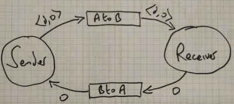

* TOC
{: toc}

## Introduction

Aims

* Make progress with Pluscal, TLA+ and TLC in modelling and analysing some 
  simple concurrent systems that make use of message channels
* Use Pluscal, TLA+ and TLC to model and analyse simple communicating systems with 
  respect to safety and liveness properties

## The Alternating Bit Protocol

The alternating bit protocol is a communication protocol that is intended to achieve reliable
communication between 2 processes using faulty channels. The protocol is able 
to protect against a small number of channel errors that could otherwise lead 
to message loss or duplication.



The protocol works by attaching a single protocol bit as an additional field to
the message that is sent. So a message with data $$d$$ is transmitted as
$$\langle d, b \rangle$$, where $$b$$ is either $$0$$ or $$1$$. Initially, the
sender sends a message with protocol bit $$0$$ and the receiver sets its
protocol bit to $$1$$.  Whenever the receiver receives a message with a
protocol bit that is different from its own protocol bit, the receiver treats
the message as a valid new message and it sends the protocol bit that has been
received as an acknowledgement (see the diagram above). It then flips its own
acknowledgement bit in readiness for the next message transmission. If the
received message has a protocol bit that is the same as the receiver's protocol
bit, it is treated as a duplicate message and discarded, and the receiver
leaves its own protocol bit unchanged. If the sender receives an
acknowledgement bit that is the same as the protocol bit of the transmitted
message, then it assumes that the message has been received successfully,
generates a new message with a protocol bit that is the inverse of the protocol
bit on the previous message (i.e. if it previously transmitted a message with
protocol bit $$0$$, it creates a new message with protocol bit $$1$$ and, if it
previously transmitted a message with protocol bit $$1$$, it creates a new
message with protocol bit $$0$$) and starts transmitting the new message. If
the sender receives an acknowledgement bit that is different from the
transmitted protocol bit, or if it fails to receive an acknowledgement at all
within some acceptable time limit, then it retransmits the message (with its
original protocol bit).  Similarly, it the receiver fails to receive a new
message within some acceptable time limit, then it retransmits the previous
acknowledgement bit.

## Checking Safety and Liveness Properties of the Alternating Bit Protocol

1. Clone the repository that provides the starting point for your work on the
   alternating bit protocol and load the file `PCalAlternatingBit.tla` into the
   toolbox.

   ```sh
   $ git clone https://github.com/davidkendall/PCalAlternatingBit
   ```

1. Complete the specifications of the `Sender` and `Receiver` processes. Use
   the comments in the specification to guide your work. You only need to
   change the first clause of the `either` statement at step `s3` in the
   `Sender`, and the first clause of the `either` statement at step `r2` in the
   `Receiver`.

1. Use the translator to translate your Pluscal specification into TLA+.
   
1. Write a `TypeOk` operator that specifies the expected types of the variables
   `AtoB`, `BtoA`, `AVar`, `BVar`, `b`, and `msg`. 

1. Create a new model. In the `What is the model?` box, specify `Data` as a
   `set of model values` (a small set will suffice, e.g. `{d1, d2, d3}`).  You
   will also need to add a *state constraint* to restrict the model to states
   in which the `AtoB` and `BtoA` channels have some small finite length (e.g.
   3), otherwise the length of these channels can grow without bound and your
   model-checking will never terminate.  Add `TypeOk` as an invariant and run
   the `TLC` model checker to check that it is true. If it is not, revise your
   specification and try again. Repeat until `TypeOk` is true.

1. The key property of the protocol is that whenever any properly formed `AVar`
   message is transmitted by the `Sender`, it is eventually received by the
   `Receiver` and assigned to `BVar`. Define an operator, `Live`, to specify
   this property as a temporal formula. Add `Live` to the `Properties` box in
   your model and run `TLC` to check it. You should find that the `Live`
   property is violated. Modify the specification so that `Sender` and
   `Receiver` are *fair* processes (refer to section 4.6 in the [Pluscal User's
   Manual]({{site.baseurl}}{{site.raurl}}/p-manual.pdf) if you've forgotten how
   to do this).  Check the `Live` property again. Is the `Live` property
   satisfied now. Why or why not?

1. Add another process, `Demon`, to the Pluscal specification. The `Demon`
   process should be used to model errors that might occur in the channels
   `AtoB` and `BtoA`. You can use the `Demon` process to discover what
   channel errors the alternating bit protocol is able to handle (i.e.
   can transmit and receive successfully in the presence of those errors).
   Specify a `Demon` process for each of the following possible channel
   errors:
    * A single message is lost by the `AtoB` channel
    * A single acknowledgement is lost by the `BtoA` channel
    * A single message is duplicated by the `AtoB` channel
    * A single acknowledgement is duplicated by the `BtoA` channel
    * Two consecutive messages are lost by the `AtoB` channel
    * Two consecutive acknowledgement are lost by the `BtoA` channel

   In each case, use TLC to check whether or not the `Live` property is
   still satisfied. **Note:** You can use the `Remove` operator, defined at
   the top of the module, to model message loss. You will need to write
   your own `Duplicate` operator to model message duplication.

## Homework

1. Watch Lamport's videos on the alternating bit protocol 
   [[VID09a](https://lamport.azurewebsites.net/video/video9a.html), [VID09b](https://lamport.azurewebsites.net/video/video9b.html)]

1. Make sure that you have completed all exercises to date.


