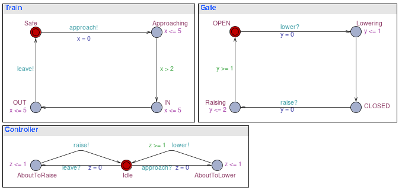

* TOC
{: toc}

## Introduction

Aims

* Learn how to install the UPPAAL tool for modelling and analysis of 
  real-time systems
* Use UPPAAL to model and analyse a level-crossing control system

## Installing UPPAAL

Installation of UPPAAL is quite straightforward. You need a full Java RTE 
(run-time environment), e.g. `openjdk-8-jre`, to
use all features satisfactorily. Then it's just a case of downloading and
unzipping the file [uppaal.zip]({{ site.baseurl }}/uppaal.zip) to a suitable
installation directory, e.g. `$HOME/.local/pkg`, and ensuring that
`$HOME/.local/pkg/uppaal64-4.1.22` is in your `PATH`. It should be 
possible to start `uppaal` now. If not, ask your lab tutor for help.

   ```sh
   $ uppaal &
   ```

## The Level Crossing

A simple example of a system with real time constraints is an
automatic controller for a gate on a railway crossing. The example has
been studied extensively. We consider a simple system consisting of
three components: a train, a gate and a controller. Each of these can
be modelled as a timed automaton, as shown. 



Timing constraints are expressed using 3 clocks: $$x$$ for the train, $$y$$ for the
gate and $$z$$ for the controller. The train advises the controller of its
approach at least 2 minutes before it enters the crossing.  The approach of the
train is indicated by the event name `approach!`.  The train is reckoned to
have entered the crossing when it reaches the location labelled `IN`.
The maximum delay between the events `approach` and `exit` is 5
minutes. The gate is open in location `Gate.OPEN` and closed in location
`Gate.CLOSED`. The events `raise` and `lower` are used to
indicate requests for service from the gate by the controller.  The locations
`OPEN` (resp. `CLOSED`) indicate that the gate has been completely
raised (resp. lowered). The controller idles in location
`Controller.Idle`. Whenever it detects that the train is approaching, it
requests that the gate should be lowered. Similarly, whenever it detects that
the train has left the crossing, it requests that the gate should be raised.
The complete system is expressed as the composition of the three components
$$Train \parallel Gate \parallel Controller$$.  The safety requirement for the
system is straight forward: whenever the train is in the crossing, the gate
should be closed.

## Exercises

1. Use the UPPAAL tool to construct the level crossing model exactly as shown
   in the diagram. You should declare the synchronisation labels as *channels*
   in the global declarations section (use the keyword `chan`). The clocks
   should be declared locally in each template declaration section (use the
   keyword `clock`). The system should be declared in the system declarations
   section.

1. Experiment with the model using the UPPAAL simulator, until you are
   confident that you understand both the model and the major features of the
   simulator.

1. Give examples from the model of the level crossing of:
   1. a location,
   1. a guard,
   1. an invariant,
   1. a synchronization label,
   1. a clock reset set 
  
1. How does the timed automaton (TA) model show that there is a delay of at
   least 2 minutes between the approach of the train and its entry into the
   crossing?

1. How does the TA model show that the maximum delay between the approach of
   the train and its exit from the crossing is 5 minutes?  How would you modify
   the model to change the maximum delay to 8 minutes?

1. What are the bounds on the time taken to:
   1. completely raise the gate, following a raise request from the controller;
   1. completely lower the gate, following a lower request from the controller?

1. Modify the TA model to show that it takes between 1 and 2 minutes to lower
   the gate and exactly 1 minute to raise the gate.

1. What is the response time of the controller to the events `approach!`  and
   `exit!`? Ask for help if you're not sure what is meant by *response time*.

1. In the TA model, what corresponds to:
   1. "the train is in the crossing", and
   1. "the gate is down"?  Is it possible for the system to reach a state
      satisfying (a) but not (b)? How can you check your answer?

1. In the TA model, what will happen if a train approaches when there is
   already a train in the crossing?

1. What would be a suitable *liveness* requirement for the system? 

1. Assume that we can write down a description of the system state as follows:
   $$((Safe,OPEN,Idle),(0,1,2))$$, where the first tuple $$(Safe,OPEN,Idle)$$
   represents the current location for the Train, Gate and Controller
   components, respectively, i.e. the Train is in location Safe, the gate is in
   location OPEN and the controller is in location Idle; and the second tuple
   $$(0,1,2)$$ represents the values of the clocks $x, y$ and $z$,
   respectively, i.e.  $$x = 0$$, $$y = 1$$ and $$z = 2$$. A transition can be
   shown as, e.g., $$((Safe,OPEN,Idle),(0,0,0)) --3.5->
   ((Safe,OPEN,Idle),(3.5,3.5,3.5))$$.

   Draw a trace of the system, in this style, which shows the complete passage
   of a train through the crossing. Any trace which respects the rules for
   generating discrete and timed transitions is acceptable.

## Homework

1. Read the UPPAAL tutorial referred to on the module page.
1. Make sure that you have completed all exercises to date.


