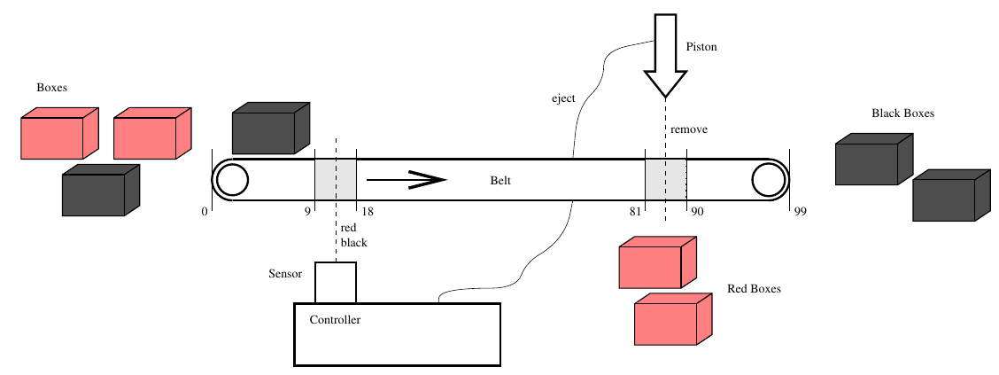

* TOC
{: toc}

## Introduction

Aims

The box sorter example has been developed by the UPPAAL team. This
set of exercises is intended to help you to explore the example and to use
it to develop your understanding of the use of TA in modelling 
real-time systems.

## The Box Sorter

This description is taken from Johan Bengtsson.

The figure below shows a control scenario for sorting
different coloured boxes.The box-sorter shown in the figure is a small
device made in LEGO. It sorts red and black boxes. The sorter is built
around a belt that transports boxes in the unit, which consists of
four components: a colour-sensor, a piston, a controller, and an
observer.

The unit operates as follows: A box starts at the leftmost extreme of
the belt, represented by position 0. At some position from 9 to 18 its
colour is sensed by the colour-sensor which is attached to the
controller. The controller reacts if the colour is red by sending an
eject request to the piston, after a certain delay. The piston ejects
within one time unit after the arrival of a request. When the piston
is ejected it is guaranteed to remove the box if it is positioned in
the interval 81 to 90. If the box is not removed (i.e. if the box is
black), it proceeds to position 99, representing the rightmost extreme
of the belt, where it falls off the belt.

The observer is not participating in the sorting of boxes. Its only
task is to observe that no red boxes appears on the rightmost extreme
of the belt. As the observer is not part of the sorting mechanism, we
have not shown her in the figure but she can be imagined to sit at the
far right end.

For simplicity we regard the system as being correct if the observer
sees no red boxes (i.e. only black boxes) at the rightmost extreme of
the belt.

## Exercises

1. Download the [box-sorter model]({{site.baseurl}}{{site.raurl}}/resources/box-sorter.xml) by
   clicking the link with the right mouse button and choosing `Save Link As`.

   Start up UPPAAL and open `box-sorter.xml`. Familiarize yourself with 
   each of the process templates and the various declarations.

1. Apply the simulator to the model and observe the behaviour.

1. Identify in the model the declaration of 
   1. an urgent channel
   1. a non-urgent channel
   What is the difference between the two sorts of channel? Find
   *two* examples in the model of the use of an urgent
   channel. Explain how the behaviour of the system would be changed
   for your example if the channel was non-urgent. (Refer to the UPPAAL
   tutorial for guidance about urgent channels.)

1. What is the delay between the controller detecting a red box on the
   conveyor belt and issuing an eject command to the piston? How is the delay
   expressed in the model?

1. How can the model be changed so that  the window of colour detection is 
   narrowed to positions 12 to 16 inclusive?

1. How can the model be changed so that the box is ejected at positions
   83 to 88?

1. Use the verifier to state and check the property that the system is 
  correct.

1. What is a simple way of changing the model so that it is NOT correct,
   i.e. so that it is possible for a red box to reach the end of the line
   without being ejected?

1. Try to verify the property for your incorrect model and use the
   diagnostic trace to see what went wrong. (Use the Help system to find out
   about exploring diagnostic traces.)   

## Homework

1. Read the UPPAAL tutorial referred to on the module page.
1. Make sure that you have completed all exercises to date.

