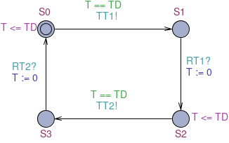
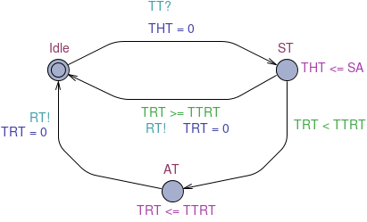

* TOC
{: toc}

## Introduction

Aims

The timed token protocol is a medium access control (MAC) protocol
which is widely use in high bandwidth real-time networks, e.g. FDDI,
IEEE 802.4, SAFENET etc. These exercises explore a simple model of the
protocol with a view to analysing the effects of its key parameters.

## The timed token protocol
The timed token protocol is a token ring LAN protocol in which we assume the
network is organised as a *ring* of N nodes. A node is allowed to transmit only
when holding the *token*. There is only one token. Each node has a 
*synchronous allocation* (SA) which is an allocation of time during which it
is able to transmit its *synchronous* (high priority) messages. If a node has
*asynchronous* (best-effort) messages to transmit, it may be allowed to
transmit them after it has transmitted its synchronous messages, but only if the time
since it last released the token is less than a protocol parameter known as
the *target token rotation time* (TTRT). The parameters SA and TTRT are key
parameters of the protocol that determine its real-time performance.

The time since a node last released the token is modelled by a clock variable
*TRT*. The time for which a node has been holding the token is represented by a
clock variable *THT*. The time to transmit the token from a node to its
neighbour in the ring is represented by a model of the ring in which the
transmission delay is represented by a clock variable *TD*. A node synchronises
with the ring on the actions *TT* (Take Token) and *RT* (Release Token).

The major component templates of the protocol for a simple 2-node ring
are shown in the figures below. 
<figure>

<figcaption style="text-align:center"><strong>RING</strong></figcaption>
</figure>
 
<figure>

<figcaption style="text-align:center"><strong>NODE</strong></figcaption>
</figure>

## Exercises

1. Download the [ttp model]({{site.baseurl}}{{site.raurl}}/resources/ttp.xml) by
   clicking the link with the right mouse button and choosing `Save Link As`.
   Start up UPPAAL and open `ttp.xml`. Familiarize yourself with 
   each of the process templates and the various declarations.

1. Apply the simulator to the model and observe the behaviour.

1. How does the model of the ring represent the *transmission delay*?

1. How can you express the transmission delay as an *interval* rather than a
   point, e.g. the delay is between 35 and 40 rather than the delay is exactly
   40?

1. How can you express *node-specific* transmission delays, i.e.  a different
   transmission delay when passing from node 1 to node 2 than when passing from
   node 2 to node 1? 

1. Identify a clock variable that is reset as a node begins its
   synchronous transmissions, and is not reset again until the next time
   it begins its synchronous transmissions. The largest value of such a
   clock variable measures the maximum time that elapses between 
   the beginning of consecutive synchronous transmission periods for the node.

1. How can you model a node that *must* use its *full* synchronous allocation? 

1. What is measured by `TRT`?

1. State and check a property that a node never waits for more than some
   well-specified time between starting its synchronous transmissions. Relate
   the specification of the period to the target token rotation time (TTRT).
   *Hint: the time between synchronous transmissions may need to be some
   multiple of the TTRT*. Is your property satisfied for the existing
   parameters? If not, adjust the parameters so that it is satisfied. If so,
   adjust the parameters so that it is not satisfied.

1. State and check a property that two nodes are never transmitting
   simultaneously. How are things affected if a node must use its full
   synchronous capacity?

1. Modify the model to make use of arrays of channels, clocks and bounded
   integer variables. Then extend the model so that it models a network
   consisting of 3 nodes. You should find that you can simplify the model of
   the RING to include just 2 locations. How is the maximum time between
   consecutive synchronous transmission periods related to TTRT now?

## Homework

1. Read the UPPAAL tutorial referred to on the module page.
1. Make sure that you have completed all exercises to date.

