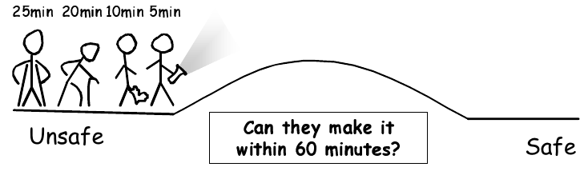

* TOC
{: toc}

## Introduction

Aims

The bridge example has been developed by the UPPAAL team in order to
demonstrate the application of TA to the solution of scheduling problems. This
set of exercises is intended to help you to explore the example and to use
it to develop your understanding of the use of TA in modelling 
real-time systems.

## Synthesising a schedule for crossing the bridge

Four wounded Vikings are about to cross a damaged bridge in the middle of the
night. The bridge can only carry two of the Vikings simultaneously and to
find their way over the bridge the Vikings need to bring a torch.  The
vikings need 5, 10, 20 and 25 minutes (one-way) respectively to cross
the bridge. Does a schedule exist which gets all four vikings over the bridge
within 60 minutes? The figure illustrates the problem.
<figure>

<figcaption style="text-align:center"><strong>The Bridge</strong></figcaption>
</figure>

## Exercises

Download the bridge model from the module page.

Start up UPPAAL and open `bridge.xml`. Familiarize yourself with 
each of the process templates and the various declarations.

1. Apply the simulator to the model and observe the behaviour.

1. Without using UPPAAL, try to calculate a schedule for the Vikings crossing
   the bridge that shows that all Vikings can reach the safe side within 60
   minutes.

1. Now, construct a property specification in the verifier that checks that all
   Vikings can reach the safe side within the time limit.

1. Use UPPAAL to verify the property you specified (make sure that the
   diagnostic trace option is turned on for the verification).

1. Use the simulator to examine your diagnostic trace and write down the
   schedule which it suggests. Is this the schedule that you constructed for
   yourself? If not, where did you go wrong before?

1. Can you construct property specifications that allow you to place additional
   constraints on the schedule found? For example, can you determine if there
   is a schedule in which the slowest Viking becomes safe first? If there is no
   such schedule for the specified time limit (60 minutes), can you find the
   smallest time limit for which such a schedule does exist?

1. Modify the TA model to include an extra Viking who requires 15 minutes to
   cross the bridge. What is the shortest time in which all Vikings can become
   safe now?

## Homework

1. Read the UPPAAL tutorial referred to on the module page.
1. Make sure that you have completed all exercises to date.
1. Make progress with the assignment.

