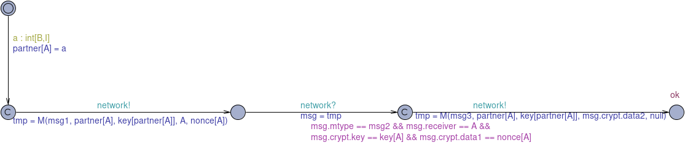
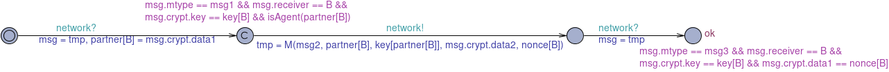
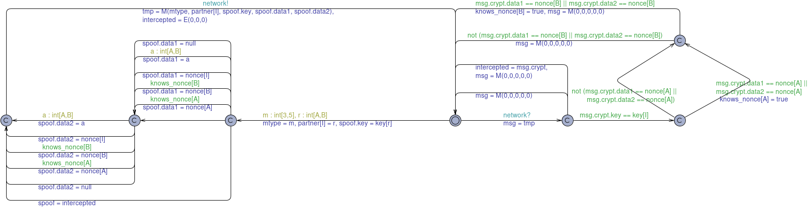

* TOC
{: toc}

## Introduction

Aims

To see how a model-checker can be used to analyse a security protocol and detect
possible attacks against it *even when the cryptographic functions used in it
are assumed to be perfectly secure*.

## Needham Schroeder Public Key Protocol (NSPK)

This authentication protocol was published in 
Roger Needham and Michael Schroeder, *Using encryption for authentification in large networks of computers*, Communications of the ACM, 21(12), December 1978, and was used and
regarded as secure for 17 years, until Gavin Lowe published details of a potential attack
on it, which he discovered using a model-checker. See Gavin Lowe, [An Attack on the Needham-Schroeder Public-Key Authentication Protocol]({{site.baseurl}}{{site.raurl}}/reading/low95.pdf), Information Processing Letters, 56:3, pp. 131–133, 1995.

The steps of the NSPK protocol (omitting the original interaction with a key server)
are shown below.

\\[1.\quad A \rightarrow B : \\{A, N_A\\}_{K_B} \\]

\\[2.\quad B \rightarrow A : \\{N_A, N_B\\}_{K_A} \\]

\\[3.\quad A \rightarrow B : \\{N_B\\}_{K_B} \\]
<!--\\[-->
<!--\\begin{array}{ll}-->
<!--1. & A \rightarrow B : \{A, N_A\}_{K_B} \\-->
<!--2. & B \rightarrow A : \{N_A, N_B\}_{K_A} \\-->
<!--3. & A \rightarrow B : \{N_B\}_{K_B} \\-->
<!--\\end{array}-->
<!--\\]-->
## UPPAAL model to discover attack on NSPK

<figure>

<figcaption style="text-align:center"><strong>Alice</strong></figcaption>
</figure>

<figure>

<figcaption style="text-align:center"><strong>Bob</strong></figcaption>
</figure>

<figure>

<figcaption style="text-align:center"><strong>Intruder</strong></figcaption>
</figure>

## Exercises

1. In the description of the protocol given above, explain precisely in English
   the role of:
   1. A
   1. B
   1. I
   1. N_A
   1. N_B
   1. K_A
   1. K_B

   Now explain each step of the protocol as clearly as you can in English,
   revealing the justification of each agent for believing the protocol to be
   secure.

1. Download the [NSPK
   model]({{site.baseurl}}{{site.raurl}}/resources/needham-schroeder.xml).
   Start up UPPAAL and open `needham-schroeder.xml`. Familiarize yourself with
   each of the process templates and the various declarations.  Apply the
   simulator to the model and observe the behaviour.

1. Check a simple sanity property to ensure that there is some execution of the
   model that shows the protocol functioning as intended.

1. From the `Options` menu, select `Search Order -> Depth First` and 
   `Diagnostic Trace -> Some`. Check the first safety property. Explain the
   result.

1. From the `Options` menu, select `Search Order -> Depth First` and 
   `Diagnostic Trace -> Some`. Check the second safety property. Explore the
   diagnostic trace in the simulator. Write down each main step of the trace
   using the security protocol notation illustrated above and described in the
   the lecture. Does the trace match the known attack?

1. From the `Options` menu, select `Search Order -> Breadth First` and 
   `Diagnostic Trace -> Shortest`. Check the second safety property. Explore the
   diagnostic trace in the simulator. Write down each main step of the trace
   using the security protocol notation illustrated above and described in the
   the lecture. Does the trace match the known attack? If not, explain whether
   or not this trace represents a *real* attack.

1. Write and check a property that claims that the system never deadlocks.
   Given the goal of the model, does it matter if the system can reach a 
   deadlock state?

1. Lowe claims that the attack can be eliminated by including the identity
  of `B` in the 2nd step of the protocol and having `B`'s partner check that
  the message is from the expected sender. Modify the model to implement this
  protection and check the safety properties again. Does the model-checker find
  an attack now? If not, does this mean that the protocol is correct?

## Homework

1. Read the security literature recommended in the lecture.
1. Make sure that you have completed all exercises to date.
1. Make progress with the assignment.

